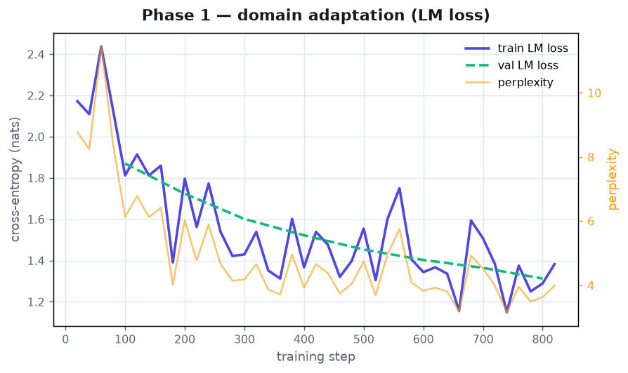
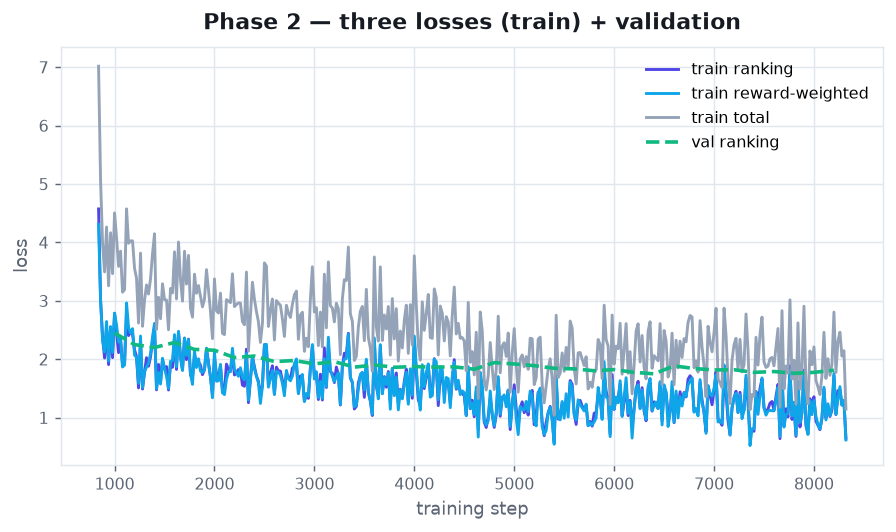
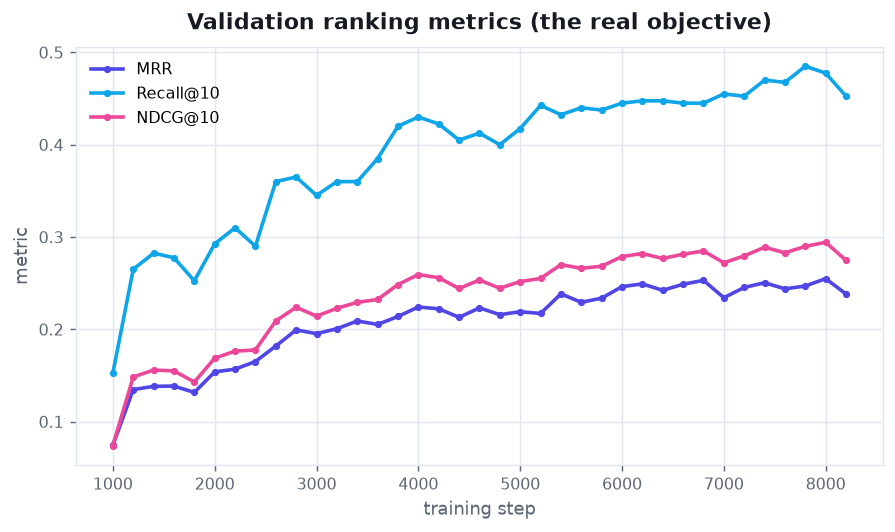
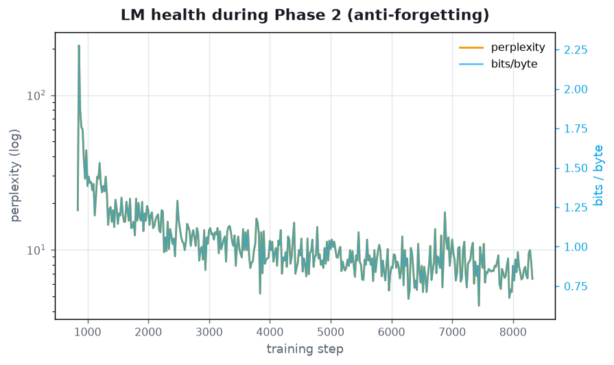

# GenRec: LLM-native recommendation, reproduced

A faithful, small scale reproduction of Netflix's
[**GenRec: Towards LLM-Native Recommendation**](https://netflixtechblog.com/genrec-towards-llm-native-recommendation-at-netflix-f20be6f643e3).
Instead of handcrafted features and a bespoke ranking model, GenRec uses a single
**LLM backbone** with a **catalog-aware ranking head**, trained in two phases with
three combined losses, and served **prefill-only** (no autoregressive decoding).

It runs end-to-end on **Amazon Beauty** (the canonical sequential-rec benchmark,
default) and also on **Yelp restaurants** (a Swiggy/Zomato flavored mode). Trained
and evaluated for real on Modal (A10G GPU).

> Reproduces the *architecture and method*, not Netflix's scale.

---

## Final results (Amazon Beauty, Qwen2.5-0.5B on Modal A10G)

Trained and evaluated on the **exact S3-Rec / TIGER Beauty slice** (22,363 users,
12,101 items, 198,502 reviews) under the published protocol (leave-one-out, 99
sampled negatives, 5-core), 8,000 test users. First pass: 1 Phase-1 epoch, 2
Phase-2 epochs, 60k capped training examples.

| Model | MRR | HR@10 | NDCG@10 |
|---|---|---|---|
| Popularity (this run) | 0.1347 | 0.2995 | 0.1554 |
| Item-kNN (this run) | 0.3103 | 0.6709 | 0.3788 |
| **GenRec (ours)** | **0.2180** | **0.3999** | **0.2466** |
| published SASRec | 0.2852 | 0.4696 | 0.3156 |
| published BERT4Rec | 0.2614 | 0.4739 | 0.2975 |
| published S3-Rec | 0.3340 | 0.5506 | 0.3732 |

GenRec clears the popularity floor decisively and lands between it and the purpose
built sequential models. A respectable first pass for a general 0.5B LLM with a
capped training set, with clear headroom (full data, more epochs, larger backbone,
harder negatives). Item-kNN is unusually strong under 99-sampled-negative eval, a
known phenomenon (Ferrari Dacrema et al., 2019); it is the real bar on this slice.

**Interactive training report:** [live artifact](https://claude.ai/code/artifact/42e37e24-0a85-498f-8703-d27a36930d0c).

### Training curves

Full per-step tracking (three losses, LM perplexity and bits/byte, train vs val,
and validation ranking metrics). Regenerate with
`python src/plot_history.py docs/history.jsonl docs`.

**Phase 1, domain adaptation.** Qwen adapts to beauty-product text. Val LM loss
tracks train (no overfitting); perplexity settles to about 4.



**Phase 2, the three losses.** Ranking, reward-weighted, and total (train), with
the dashed validation ranking loss.



**Validation ranking metrics, the real objective.** MRR climbs from 0.07 to 0.25
as the ranking head learns.



**LM health (anti-forgetting).** Perplexity and bits/byte stay controlled through
Phase 2. The LM loss keeps the backbone a competent language model while it learns
to rank.



---

## Faithfulness map (blog concept, this repo)

| GenRec (Netflix) | This repo | Where |
|---|---|---|
| Open source LLM backbone | `Qwen2.5-0.5B` (fallback `distilgpt2`) | `model.py` |
| **Phase 1** domain adaptation | Causal-LM fine-tune on verbalized item + history corpus | `train.py: phase1_adapt` |
| **Phase 2** ranking post-training | Ranking head + three losses | `train.py: phase2_rank` |
| Feature engineering to **context engineering** | History to NL prompt + token budget compaction | `verbalize.py` |
| Catalog-aware ranking head + item embeddings | Learned item-embedding table, dot / MLP scoring | `model.py: GenRec` |
| **Three losses** (ranking, LM, reward-weighted) | Same, separable for ablation | `losses.py` |
| Reward = long-term satisfaction | Rating-weighted alignment loss | `losses.py` |
| LM head kept for anti-forgetting | LM head used only for LM loss | `model.py: lm_logits` |
| **Prefill-only** serving | One forward pass, pool, rank; no decode | `model.py: rank` |
| Offline metric MRR | MRR, Recall@10, NDCG@10 | `eval.py` |

---

## The two heads (the part everyone gets wrong)

The backbone forks at the top into **two heads**:

```
                    LM head        --> token logits   (training only: anti-forgetting)
backbone -> hidden
                    ranking head   --> item scores    (the actual recommender)
```

* The **LM head** produces token probabilities and exists *only* to compute the
  language-modeling loss, which keeps the backbone a competent language model.
* The **ranking head** is a **separate learned item-embedding table**, not the
  token vocabulary. The pooled hidden state (user vector) is scored against item
  vectors via dot product or MLP.

Because recommendation is a **scoring** operation, not generation, serving needs
only the **prefill** forward pass. There is **no decode loop**. That is the whole
cost story.

---

## Two-phase training and the three losses

**Phase 1 (domain adaptation).** Verbalize every catalog item and a sample of user
histories into natural-language text, then fine-tune the backbone with plain causal
LM loss. Only the backbone trains. This teaches the model the language of the
domain before it ever ranks.

**Phase 2 (ranking post-training).** Build prefix to next-item training examples
(no leakage past the held-out val/test items). For each example, prefill the
verbalized history to a user vector and score the positive against sampled
negatives. Optimize a weighted sum of three losses:

* **ranking**: softmax cross-entropy, positive above negatives
* **LM**: causal LM on the prompt, the anti-forgetting leash
* **reward-weighted**: the same contrastive term weighted by the user's rating

Now the whole model trains: backbone, item-embedding table, and head.

---

## Key decisions (and why)

* **Amazon Beauty over Yelp.** Yelp was the first idea (restaurant flavor), but the
  canonical benchmark for sequential and generative recommendation (SASRec,
  BERT4Rec, S3-Rec, TIGER) is Amazon. Beauty is ungated, subset friendly, has rich
  item text for verbalization, and I already have exact published numbers to
  compare against. The loader reproduces the exact S3-Rec universe (verified:
  22,363 users, 12,101 items, 198,502 reviews). Yelp restaurant mode is kept as an
  alternate.
* **Match the published protocol exactly.** Leave-one-out, 99 sampled negatives,
  iterative 5-core. This makes the numbers directly comparable, not just
  same-domain.
* **Domain-aware verbalization.** One knob switches the natural-language framing
  between products and restaurants, so the same pipeline serves either dataset.
* **Full observability.** Every metric is tracked per step to JSONL (three losses,
  perplexity, bits/byte, train vs val, validation ranking metrics). Optional
  TensorBoard and Weights & Biases.
* **Crash-safe Modal runs.** `modal run` ties the job to a client that can drop and
  cancel the run, so training is **deployed and spawned** (runs server-side to
  completion) and writes history, results, and the model to a Volume as it goes.

---

## Repo layout

```
src/
  data.py             Yelp loader + synthetic fixture, catalog + sequences, leave-one-out
  amazon.py           Amazon Reviews (McAuley 2014) 5-core loader (auto-download)
  verbalize.py        history to NL prompt, token budget compaction, product/restaurant
  model.py            backbone + catalog-aware ranking head, save/load
  losses.py           ranking + LM + reward-weighted losses
  train.py            phase1_adapt + phase2_rank (instrumented) + prefill scorer
  baselines.py        popularity + item-kNN
  eval.py             MRR / Recall@K / NDCG@K with sampled negatives
  ablations.py        blog-mirroring ablations
  tracker.py          per-step metrics (JSONL, TensorBoard, W&B), LM health stats
  plot_history.py     training-curve PNGs for the README
  generate_report.py  self-contained HTML training report
modal_app.py          Modal A10G runner (deploy + spawn), writes to a Volume
notebooks/
  genrec_kaggle.ipynb Kaggle run (Yelp + Qwen2.5-0.5B)
```

---

## Quick start (local smoke test, no GPU, no download)

Tiny randomly initialized GPT-2 and a synthetic dataset with latent taste, so the
full pipeline runs on a laptop in minutes:

```bash
pip install -r requirements.txt
python src/train.py --tiny --p2-epochs 8
python src/ablations.py --tiny --p2-epochs 8
```

Even the toy 64-dim random backbone learns the latent taste (all three losses drop,
MRR climbs to about 0.23, matching the strong item-kNN baseline), which shows the
training machinery is correct.

## Real run (Modal, Amazon Beauty)

```bash
modal deploy modal_app.py
python -c "import modal; modal.Function.from_name('genrec-food','train').spawn(dataset='amazon_beauty')"
```

The function auto-downloads Beauty, runs both phases on `Qwen2.5-0.5B`, evaluates
against baselines, and writes `history.jsonl`, `results.json`, and the trained
model to the `genrec-out` Volume. A one-shot `modal run modal_app.py --dataset
amazon_beauty` also works but is tied to the client.

## Download the trained model

```bash
modal volume get genrec-out model ./genrec_model
```

Pulls the adapted backbone + tokenizer (HF format), the ranking head
(`ranking_head.pt`), and `meta.json` (model name, catalog id to title map). Reload:

```python
import sys; sys.path.insert(0, "src")
from model import load_genrec
model, tok, meta = load_genrec("genrec_model", device="cpu")
```

---

## Benchmarks

[`BENCHMARKS.md`](BENCHMARKS.md) transcribes the exact published numbers from S3-Rec
(CIKM 2020, Table 2) for both Amazon Beauty and Yelp, under the same protocol this
repo uses. Source: [arXiv:2008.07873](https://arxiv.org/abs/2008.07873).

## Roadmap

* Prefill-only serving endpoint on Modal (one forward pass, ranking head).
* Bigger backbones (scaling-law curve), full-catalog eval, richer verbalization.
* Full-data, more-epoch run to close the gap to SASRec / BERT4Rec.
